# 1. Start here

Tablelight puts a DM console on your laptop and a transparent player display over the map on your TV. Each player gets an independently positioned, rotated character HUD (heads-up display). You supply the characters and rules text. Tablelight records the numbers and reminders you choose.

This manual covers every section of the app, from a first session to library maintenance and recovery. Screenshots show original sample characters Mira, Rowan and Ash; they are not preloaded content. The examples teach the controls, not a particular game rule. You can use them as practice with a separate party backup.

## Choose your route through the guide

New DM: read this chapter, then follow [Your first session](#2-your-first-session). Preparing a campaign: use [Characters and the sheet](#4-characters-and-the-sheet), [Ability library](#5-ability-library), [Ability field reference](#6-ability-field-reference), [Passives](#7-passives-and-mixed-abilities) and [Resources](#8-slots-and-custom-resources). At the table: keep [Turns and corrections](#9-turns-damage-and-corrections), [Approvals](#10-player-requests-and-history) and [Player HUDs](#12-player-huds-and-tv-layout) nearby.

Click a Contents entry or its page number to jump. Open your PDF viewer's Bookmarks or Document outline panel for the same chapter/section navigation. Ctrl + F searches the selectable text; try “bonus action” or “Restore backup.” Zoom in on screenshots if needed. The guide is stored locally with the app, so all essential text, screenshots and internal links work offline.

## What Tablelight tracks

| The app handles                                                    | You decide and apply                                             |
| ------------------------------------------------------------------ | ---------------------------------------------------------------- |
| Configured action, bonus action, reaction, slot and resource costs | Whether an ability is legal under your table's rules             |
| Approval requests and spending after Allow use                     | Attack rolls, saving throws, damage and healing outcomes         |
| HP, temporary HP, movement, slots and custom counters              | Targets, range, areas, duration and effects on other characters  |
| Written ability details and concentration selection after use      | Concentration saves and ending concentration after a failed save |
| Passive reminders, conditions and player messages                  | Whether a passive applies and any resulting numerical change     |

It does not read or change D&D Beyond, automate the battle map, supply rulebook text, roll dice, or count rounds. The TV is one shared display, not separate private screens or remote player accounts. DM notes remain on the laptop; an opened player message can be seen by everyone near the TV.

## Install and identify the running copy

Run **Tablelight-Setup-[version]-x64.exe** to install Tablelight for your Windows account, then open its shortcut or **Tablelight.exe** in the chosen folder. No Tablelight account or Node.js is required. Once downloaded, the installer can run offline; local play and saves also work offline.

If you used an older portable copy on this computer, install this version once to enable in-app updates. It uses the same saved-party folder. When moving to another computer, install Tablelight there and transfer an exported party backup. Uninstalling keeps your saved data by default.

The DM window title shows **Tablelight [version] - DM Console**. The same version appears below **Setup & help** in the sidebar. Both show the running application's version, so you can identify which copy is open when testing or reporting a problem.

Use the installer folder choice if you want a custom location. Keep exported party backups outside that folder. To avoid opening an older copy by accident, use the shortcut created by the installer or open Tablelight.exe in the intended folder, then compare its title and sidebar version.

This manual matches the 1.12.1 development build with Passives and the offline guide. The already-published 1.12.1 release does not contain all these branch additions. The version number alone does not distinguish those copies; the Passives tab and offline guide link identify this development interface. A future release must regenerate the manual with its final release version.

## Connect the table display

1. Connect the TV. Press **Windows + P**, then choose **Extend**. Extend gives the laptop and TV separate desktops; Duplicate mirrors the DM's screen.
2. Move your player-facing map window onto the TV. Keep the Tablelight DM console and private material on the laptop.
3. Open **TV & layout**, choose the TV under **Display**, and use **Refresh** if the connection has changed. With one display you can practice locally before connecting the TV.
4. Arrange the party in the preview while the overlay is hidden. Choose **Show TV overlay** only when you are ready.
5. Check that each player can read their HUD from their seat. Adjust that player's size and rotation; keep your map in a normal or borderless window if exclusive fullscreen hides the overlay.

The overlay starts hidden each time Tablelight opens. If the selected TV disconnects, it hides again. Reconnect, refresh the display list, select the TV, and show it explicitly. See [Placement and scale](#placement-and-scale) for precise controls.

## Find your way around

The sidebar selects **DM console**, **TV & layout**, **Messages**, **Ability library**, **Condition library**, **Players & party**, and **Setup & help**. **Party** selects active characters; **All characters** holds saved players outside the party. **+ Add character** opens the character editor. The bottom reports the running version and save status.

The top bar controls global overlay visibility, direct HUD interaction and Undo. Selecting a character is different from starting their turn. On the character page, the current-turn marker follows **Start turn** and **Next turn**; simply reading Rowan's sheet does not end Mira's turn.

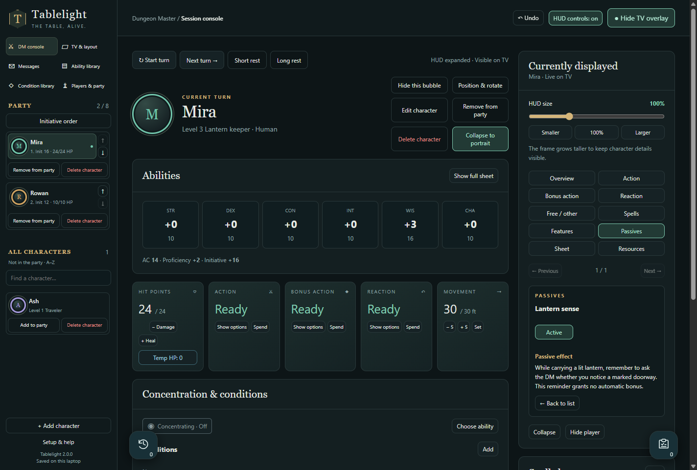

# 2. Your first session

This practice session connects the main features. Use your own values in a real campaign. Before practicing with an existing party, export a backup in **Setup & help** so you can return to it. The sample abilities below are original teaching examples with no automatic game effects.

## Create Mira and a charge pool

1. Choose **+ Add character**. Leave **Add to active party** checked. Enter Mira, class/subclass Lantern keeper, species Human, level 3, AC 14, speed 30, current/maximum HP 24, proficiency 2, and initiative order value 16.
2. Set WIS to 16, choose WIS as the spellcasting ability, and give level 1 a maximum of 3 slots. Leave the two spell overrides blank. Optionally enter a private reminder in DM notes. Choose **Save character**.
3. On Mira's DM page, choose **Add** beside **Custom resources**. Name the pool Lantern charges. Set maximum and available to 3, reset rule **Long rest**, and choose a shape and color. Choose **Add resource**.
4. Create Rowan as a second active character with initiative 12. Create Ash with **Add to active party** unchecked. Ash appears in the saved roster, not on the TV.

**Check:** Party contains Mira and Rowan, All characters contains Ash, and Mira has 24 HP, three level-1 slots and three Lantern charges. If a value is wrong, use **Edit character**; selecting a saved player opens their editor without joining the party.

## Write an active ability and a passive

1. Select Mira. In an ability tab, choose **+ Add**, then **Create new**. Name the ability Lantern flare. Set Type to **Class / species / other feature**, Behavior to **Active**, and Turn cost to **Bonus action**.
2. Write: “Raise your lantern to mark one place you can see. Describe the light to the table; apply any agreed effect manually.” Turn standard slot spending off. Under **For Mira only**, link Lantern charges and set Charges spent per use to 1. Choose **Save & add to character**.
3. Open **Passives**, then **+ Add**, **Create new**. Name it Lantern sense, use the feature Type and **Passive** Behavior. Turn on **Track whether the passive applies**.
4. In **Passive effect**, write: “While carrying a lit lantern, remember to ask the DM whether you notice a marked doorway. This reminder grants no automatic bonus.” Save it.
5. In **Ability library**, choose **Add to character** beside Lantern sense, select Rowan, choose **Continue**, then **Add to Rowan**.

**Check:** Lantern flare is shared in the library and costs Mira one bonus action plus one charge. Lantern sense appears in both characters' Passives, starting Inactive independently. It has no Use button. Change Mira's reminder to Active when she carries the lantern; Rowan remains Inactive. If you wanted only Mira's wording to change, make a local copy before editing.

## Seat players and try an approval

1. Open **TV & layout**, select the TV and choose **Arrange around TV**. Select each character under Player placement and adjust their rotation and HUD size. Show the overlay and turn HUD controls on.
2. Choose **Initiative order**, then **Sort highest first**, and **Save order**. Select Mira and choose **Start turn**.
3. Expand Mira's portrait. On the TV choose **Bonus action**, open Lantern flare and choose **Use ability**. The request appears beside her ability browser. Her projected counters reserve one charge and her bonus action.
4. On the DM screen, review the waiting request. Check Mira's name, Lantern flare and both costs, then choose **Allow use**. The actual pool changes from 3 to 2; the bonus action becomes spent. Resolve the written effect yourself.
5. If you clicked by mistake, open **History**, select the allowed request and choose **Undo this use** while the refund is still safe. For ordinary recent edits, use **Undo**. Then try the request again if desired.

**Check:** Viewing ability text spends nothing. Requesting reserves costs on the player HUD. DM approval spends them. **Deny use** and the player's **Cancel** release reservations without spending. Direct DM Use spends immediately.

## End the practice session

1. Send Mira a note from **Messages**. Read it using the envelope or **Force open**; close it to return to the HUD.
2. Apply 5 damage to Mira with **- Damage** and **Apply**. With no temporary HP, 24 becomes 19. Use **+ Heal** or Undo to correct a mistake.
3. Open **Long rest**, select Mira, read the summary and choose **Apply rest**. HP, slots and her long-rest pool refill. Conditions and conditional passive reminders remain for you to update manually.
4. Export a party backup in **Setup & help** to Documents. Close and reopen Tablelight. Characters, library, counters, reminders and HUD settings persist; the overlay starts hidden. Messages, pending approvals, History and Undo are session-only.

Use the remaining chapters for the full controls, exceptions and correction paths behind each step.

# 3. Players and party

## Saved roster and active seats

The left sidebar has two lists. **Party** shows active members in your chosen initiative order. **All characters**, underneath it, shows only saved characters outside the party in alphabetical order. Each list scrolls separately. The saved list includes search and page arrows for larger rosters, with twelve characters per page. Click a saved character's name to edit them without joining the party.

Every Party entry has **Remove from party** and **Delete character** buttons. Every All characters entry has **Add to party** and **Delete character** buttons. Adding a character places them at the bottom of party order; removing them returns them to alphabetical order below. The party supports up to eight characters.

You can also open **Players & party** for a larger management screen. Search by name, class, or species; filter to everyone, active party members, or saved players outside the party. The active-party filter follows initiative order. There is no fixed saved-player limit, subject to your laptop's memory and storage.

- **Create player / Add character:** save a new player. Uncheck **Add to active party** to save them for later. When all eight seats are taken, new players automatically stay outside the party.
- **Add to party:** load a saved player into the session. They join at the end of initiative order. If all eight seats are occupied, remove someone first.
- **Remove from party:** take them out of the DM console, turn order, table preview, and TV overlay. Their complete character, abilities, spent resources, portrait, and HUD position/rotation stay saved. Rejoining restores that setup without refreshing their resources.
- **Edit:** change a saved player's stats, portrait, skills, saves, and spell slots without joining the party. Use the shared library to assign entries to saved players; add them to the party for the full session and resource controls.
- **Delete character:** delete their saved character after confirming. This is available in both sidebar lists, on roster rows, and on the selected player's DM page. Shared library entries remain. **Undo** can restore the player during the current session.

Only active party members participate in **Next turn**, whole-party rests, and automatic TV arrangement. Each active player's Show/Hide bubble setting still applies. You can remove everyone to leave an empty party while keeping all players saved. Tablelight does not count rounds.

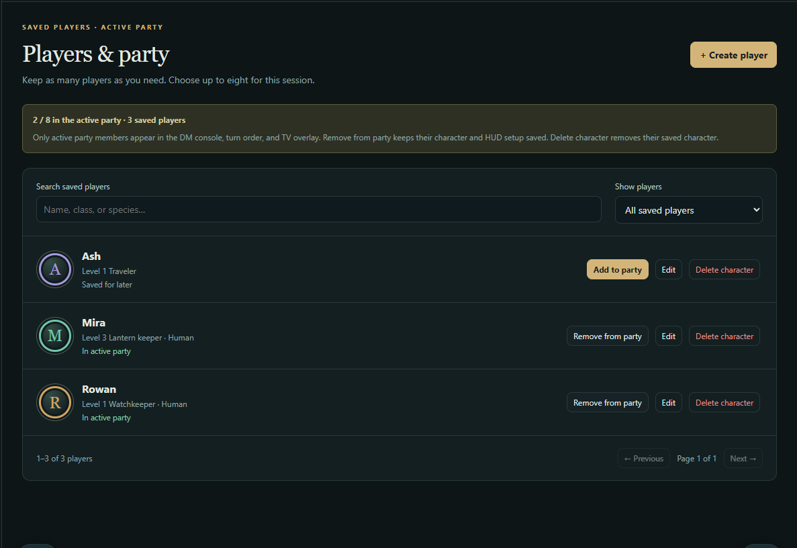

## Swap a player for a later session

1. Select **Remove from party** for the departing player. They disappear from turn order and the TV but remain in All characters.
2. Find the returning player by name, class or species in **Players & party**. Choose **Add to party**. If eight seats are occupied, remove someone first.
3. Select the returning player and inspect their HP, resources and HUD placement. They retain their previous values; joining does not perform a rest.
4. Move them to the intended initiative position. Adding always starts at the bottom of party order.

**Correction:** Add the original player back if you removed the wrong one. If you chose **Delete character**, confirm only when you intend to erase the saved character. Undo can restore a deletion during the current session. Removing a player discards their sent message; rejoining or Undo does not restore that message.

# 4. Characters and the sheet

## Character identity and combat values

Open **Edit character** beside an active player's name, **Edit** on their roster row, or click a saved player's sidebar name. For a new character use **+ Add character** or **+ Create player**. Changes remain a draft until **Save character**; **Cancel**, the close button or Escape discards that draft.

| Editor control                       | Meaning and intended use                                                                                                          |
| ------------------------------------ | --------------------------------------------------------------------------------------------------------------------------------- |
| Character name                       | The name displayed to DM and players. It does not have to be unique; check portraits/recipient identity when names match.         |
| Class / subclass; Species            | Descriptive labels. They do not grant abilities, select a theme or enforce rules.                                                 |
| Level                                | Enter the character's current level (1-30). Adjust dependent values yourself.                                                     |
| Armor class; Speed (feet)            | The displayed AC and maximum movement. AC 0-99; speed 0-999. A passive does not change either automatically.                      |
| Current HP; Maximum HP; Temporary HP | Enter current totals. Maximum HP is at least 1; other HP values can be zero. Temporary HP is a separate pool.                     |
| Proficiency bonus                    | The number used for trained skills/saves and automatic spell totals. Enter it explicitly; leveling up does not select it for you. |
| Initiative order value               | The roll/value available to the order dialog. Editing it alone does not reorder the party.                                        |
| Player color; Theme                  | Color identifies the character; Theme changes the HUD palette independently of typed class.                                       |
| DM notes                             | Up to 40,000 characters of private notes on the laptop Sheet. They are saved/backed up but omitted from the player overlay.       |

**Upload portrait** opens an image chooser; select PNG, JPG or WebP. **Remove image** restores the fallback portrait. The preview belongs to the draft until Save character. The saved image travels with the character and exported backup.

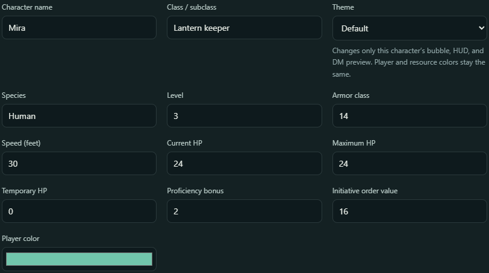

## Ability scores and training

Enter STR, DEX, CON, INT, WIS and CHA (1-30). The app displays their modifiers. Skills use the corresponding ability modifier and your proficiency settings. A manual skill bonus override takes priority over that calculation.

1. Open the character's **Sheet** tab or **Edit character**.
2. Find the skill or saving throw. Choose **P** for proficiency or **E** for expertise. Expertise includes proficiency and uses twice the proficiency bonus.
3. Choose P again to clear training. Choose E again to return from expertise to proficiency. In the editor, save the character; on a live Sheet, the change applies immediately.
4. In the editor's skill override field, enter an exact total if needed, or clear it to return to the normal calculation. Check the resulting bonus on the Sheet.

**Example:** WIS 16 gives a +3 modifier. With proficiency 2, Perception is +3 untrained, +5 proficient or +7 with expertise. An explicit bonus override of 9 displays +9. Raising WIS later leaves that explicit override in control until you clear it.

The same P/E controls are available on the interactive TV Sheet. This is a saved character edit, not a die roll. Undo can reverse an accidental click. Saving throws have P/E training; the editor's skill override boxes apply to skills.

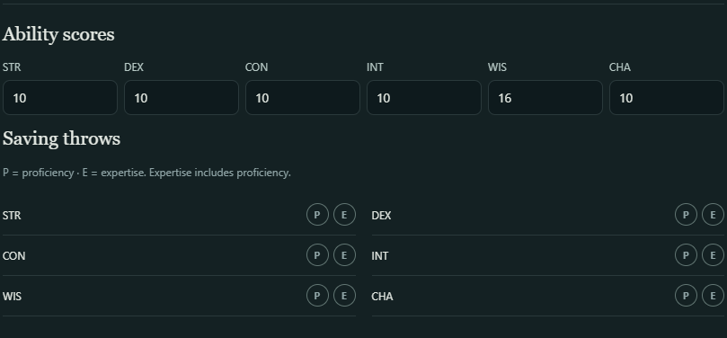

## Spellcasting fields and standard slots

Choose **Spellcasting ability** for automatic displayed spell totals. A blank Spell DC override uses 8 + proficiency + the selected ability modifier; a blank Spell attack override uses proficiency + that modifier. An entered override replaces the corresponding displayed total. With Mira's WIS 16 and proficiency 2, the automatic DC is 13 and spell attack is +5.

These sheet totals do not rewrite an ability's manual Attack or Save text. If an ability says “DEX 15,” changing Mira's ability score does not change that string.

Enter maximum standard slots for levels 1-9. Raising a maximum adds that increase to available slots; lowering it caps the remaining count. Use the DM slot minus/plus controls to correct availability during play. Setting a maximum of zero removes that level's usable pool. For special or homebrew pools, see [Slots and custom resources](#8-slots-and-custom-resources).

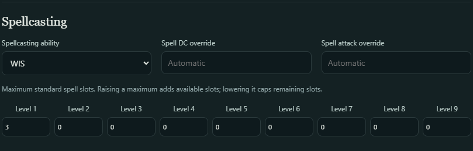

## Character themes

In **Create character** or **Edit character**, choose **Theme**, then **Save character**.
The choices are **Default**, **Artificer**, **Barbarian**, **Bard**, **Cleric**, **Druid**,
**Fighter**, **Monk**, **Paladin**, **Ranger**, **Rogue**, **Sorcerer**, **Warlock**, and **Wizard**.
The selected colors appear on that character's collapsed bubble, expanded HUD, and DM preview.
The typed **Class / subclass** does not choose a theme: multiclass, homebrew, and same-class
characters can each use whichever palette they prefer.

**Default** restores the original appearance. **Player color** still identifies the character;
portraits, ability images, resource colors, spending, HUD size, position, and rotation stay the
same. **Cancel** leaves the saved theme untouched; **Undo** can reverse a saved change during
the current session. You can change themes from the DM screen while the overlay is hidden or
click-through. Changing a theme does not show a hidden bubble or window.

Themes stay with active and inactive characters, including after restarting, removing/rejoining
the party, and exporting/restoring a backup. Older saves start with Default. If the editor says
**Default (saved theme unavailable)**, this version cannot display that saved theme. It keeps
the original choice when you edit other fields. Choose Default or a class theme to replace it.

# 5. Ability library

## Choose shared or character-only

An ability definition contains its written rules and general costs. A character assignment connects that definition to one player's resource pool and availability. You can reuse one definition across the party while keeping counters independent.

| Route                            | Result                                                                                                     |
| -------------------------------- | ---------------------------------------------------------------------------------------------------------- |
| Character + Add, Create new      | Create a shared entry and assign it to this character when saved.                                          |
| Character + Add, Choose existing | Link this character to an existing shared entry.                                                           |
| Library + Create new             | Create a shared entry without assigning it yet.                                                            |
| Library Add to character         | Choose an active or saved player, Continue, review the entry and character costs, then Add to that player. |
| Create new local ability         | Start a blank ability that belongs only to this character.                                                 |
| Create local-only copy           | Copy a library definition independently into this character.                                               |

The library starts empty and can be built before any characters exist. Search matches names, descriptions, passive text, references, upgrades and manual detail fields; multiple search words must all match. Filter by Type, Passives (including mixed abilities), or a turn-cost category. The list shows at most 100 matches; narrow the search for a large library. “Already added” prevents a duplicate shared assignment to the same character.

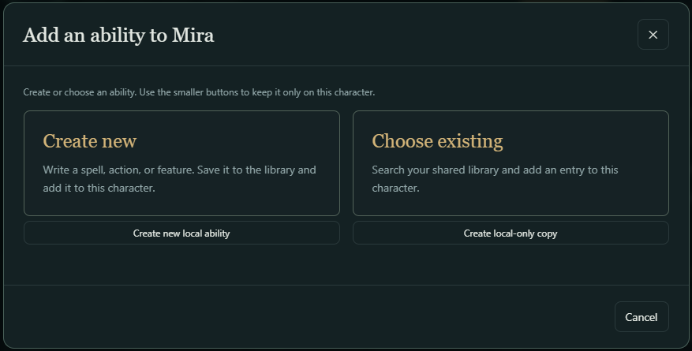

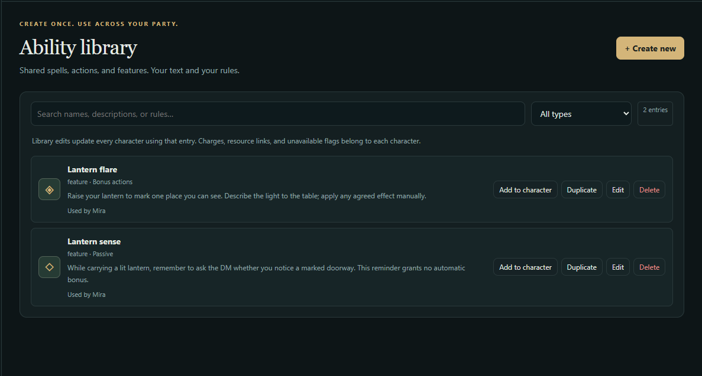

## Create and assign a reusable ability

1. In **Ability library**, choose **+ Create new**. Enter the name, Type, Behavior and, for active effects, Turn cost. Fill the details you want to read during play.
2. Choose **Save to library**. With no character selected, resource-link controls explain that you must choose a character first.
3. Choose **Add to character** on the saved entry. Select a character, choose **Continue**, then review the preview. Set their resource link/charge cost if applicable and choose **Add to [name]**.
4. Repeat for another character. Each character's remaining charges, slot counts, unavailable flag and conditional passive state remain independent.

**Check:** Editing the shared description updates both assignments. Spending Mira's charges does not spend Rowan's. Remove an assignment with **Remove from character** and confirm; the definition remains available in the library. To undo a mistaken removal, use Undo before closing the app.

## Shared edits and personal exceptions

The editor labels shared fields and the **For [character] only** section. Name, image, Type, Behavior, Turn cost, slot/concentration settings and written rules are shared. Linked resource pool, charges spent per use and **Mark unavailable for this character** belong to the assignment. A conditional passive's Active/Inactive reminder is also personal.

If only one character needs different text, a different turn cost or different standard-slot settings, create a separate library variant or local copy before editing. **Mark unavailable** is a manual active-use restriction; it does not mean a passive is Inactive. Use the passive reminder switch for that separate purpose.

## Duplicate, detach and delete safely

Each Ability library row has **Delete** beside **Edit**. For an assigned ability, a warning lists every character using it, including characters outside the active party. Choose:

- **Edit instead** to open the shared editor. This white button sits immediately left of the yellow **Make local copies and delete…** button.
- **Remove and delete** to remove the ability from all assigned characters and delete it from the library.
- **Make local copies and delete…** to choose who keeps an independent copy. A second dialog lists every assigned character, all checked by default. Checked characters keep a local version with the same name and their own resource settings; unchecked characters lose the assignment. **Go back** returns to the warning. **Make local copies and delete** confirms the choices and deletes the library entry.

Existing local copies and spent resources remain unchanged. If assignments change while the warning is open, review the refreshed list before confirming. **Undo** restores a confirmed deletion and its assignments together during the current session.

**Duplicate abilities:** Click **Duplicate** on an Ability library row to make a
separate library version. It gets a name such as **Guiding Bolt (1)**, then **Guiding Bolt (2)**
if the first name is taken. The copy opens for editing and is not assigned to anyone automatically.

On a character's ability tab, click the **copy icon** between Use and Edit. Hovering shows
**Duplicate locally only**. The row reads View, Use, copy icon, Edit, with Remove from character
underneath. This adds a separate copy
to that character and opens its editor. A small **person icon** before the name identifies local
abilities in the character list, details, and HUD; hover to see **Only on this character**. You can change all
its text and costs without changing the original or another character. It does not appear in the
ability library, and later library edits do not change it. Numbering checks the names already on
that character. Both duplicate buttons create the copy immediately; Cancel closes the editor and
keeps the copy, while Undo can reverse the duplication.

The character's **+ Add** dialog also has two smaller buttons:

- **Create new local ability**, below Create new, opens a blank editor and saves only to this character. Cancel leaves no new ability.
- **Create local-only copy**, below Choose existing, opens the library picker. Click **Copy locally** to make an independent character copy, even if the shared ability is already assigned. The name stays the same unless it is already on this character, in which case a number is added. The copy opens for editing immediately; Cancel keeps it, and Undo can remove it.

Hover over either smaller button for an explanation. These options never add to or edit the shared library.

For a spell with two special casts per long rest, keep the original linked spell for slot casting.
On the local copy, uncheck **Spend a standard spell slot**, link your special resource pool, and
set **Charges spent per use** to 1. Set that character's pool to a maximum of 2 and **Long rest**
recovery. The local version spends the pool; the original still spends spell slots.

Local copies stay with the character when moving out of the party, reopening Tablelight, and
exporting/restoring backups. **Remove from character** removes that local copy and supports Undo.

For library-linked abilities, the name, description, spell details, and turn cost are shared. Editing them updates every linked character. Each character keeps their own resource pool link, charges spent per use, remaining resources, and unavailable flag. The editor labels these character-only settings separately. Create a local copy when an ability needs different details or slot settings for just one character.

Every ability in the DM’s character lists has **Remove from character** alongside View, Use, and Edit. Confirming removes the ability from that character and keeps its library entry. **Undo** restores the assignment. Deleting a character also keeps the library. Deleting from the Ability library offers the removal and local-copy choices described above. Undo can reverse these changes during the current session.

Existing abilities from older saves move into the library automatically. Exact matches share an entry; different homebrew versions remain separate. Positions, rotations, resources, and selected descriptions are preserved.

## Ability images and limits

**Ability images:** In an ability editor, choose **Upload image** to add artwork, **Replace image**
to change it, or **Remove image** to return to the usual spell, action, or feature symbol.
The preview shows the complete picture. Choose **Save shared entry** (or the character-only Save
button) to apply your changes. **Cancel** keeps the saved image; a failed upload keeps the previous
preview so you can try again. **Undo** can reverse a saved image edit during the session.

Use PNG, JPEG, or static WebP, up to **5 MiB** and **4096 pixels per side**. Tablelight fits it
within **256 × 256 pixels**, keeps transparency and orientation, and does not crop or enlarge
small images. Converted images have a **300 KiB** limit; all saved ability images together have
an **8 MiB** limit. A shared image counts once, while each independent local copy counts separately.
If saving would exceed the limit, remove or replace some artwork and try again.

Shared images update every linked character, including saved players outside the active party.
Character-only abilities keep their own images. Artwork appears beside abilities on both screens,
including the library picker and details. Names and availability remain visible, and a missing or
unreadable image uses the usual symbol. Images save with your party and exported backups; you do
not need to keep the original source files for Tablelight to display them.

**Practice variant:** Keep Lantern flare shared. On Mira, use the copy icon to duplicate it locally. Change the local copy's name to Lantern flare - special cast, turn off standard-slot spending, and link a pool with two charges per long rest. The original and local variant now have separate use settings. The person icon identifies the local version; later shared edits leave it alone.

An uploaded image is decorative identification. Names, availability and cost information stay visible when artwork is absent or invalid. Portraits and ability images are different controls: changing an ability image does not change the character portrait.

# 6. Ability field reference

## Type, Behavior and Turn cost

**Type** chooses the grouping: **Action / ability**, **Spell**, or **Class / species / other feature**. It does not restrict the other fields. A feature can cost a spell slot; a spell can cost a bonus action or reaction.

**Behavior** chooses Active, Passive, or Passive + active. Active has ordinary Use controls. Passive has a written reminder and no Use or spending. Passive + active has both views on one assignment. **Turn cost** is the active-use cost: Action, Bonus action, Reaction, or Free / other. It disappears for a pure passive. Free / other avoids those turn counters but can still spend slots or resource charges.

**Casting Time** is descriptive text, such as “a quick signal.” It does not set Turn cost. Type and Turn cost affect different lists: Spells gathers spells, Features gathers features, while Bonus action gathers all active abilities whose cost is a bonus action.

## Every detail field

Blank detail fields are hidden when reading the ability. The app accepts your text without calculating or enforcing its rules. A blank Name becomes Unnamed ability.

| Field                       | What to write / how it behaves                                                                                   |
| --------------------------- | ---------------------------------------------------------------------------------------------------------------- |
| Name                        | A recognizable title. Use a distinct variant name when costs or rules differ.                                    |
| Trigger                     | When the ability becomes relevant; especially useful for reactions. It does not automatically detect that event. |
| Duration                    | How long an effect lasts. No countdown or automatic expiry is started.                                           |
| Range; Area                 | Targeting distances/shapes for the reader. No map measurement occurs.                                            |
| Casting Time                | Written timing; separate from the Turn cost that actually spends a counter.                                      |
| Spell Level                 | None, Cantrip or levels 1-9, available for every Type. None is distinct from Cantrip.                            |
| Components; School          | Your component and school notes, shown as entered.                                                               |
| Attack                      | Exact text, such as “+5, roll manually.” Character changes do not recalculate it.                                |
| Save; On Save               | For example “DEX 15” and “Half damage.” These do not roll or apply a result.                                     |
| Damage / Healing            | The formula or outcome to read. Apply the result to HP yourself.                                                 |
| Upcast / Upgrades           | Improvements from a higher slot or character level. Up to 40,000 characters; does not apply improvements.        |
| Requirements; Special       | Longer prerequisites and exceptions, displayed as labeled text sections.                                         |
| Description / Active effect | Main active instructions. The label becomes Active effect for a mixed ability.                                   |
| Passive effect              | The reminder for Passive or Passive + active. It does not change statistics.                                     |
| Reference                   | Plain text source or your own note, up to 300 characters; shown last, at the bottom right of details.            |

Long descriptions, upgrades, requirements and special notes are paged on the HUD. Use Previous/Next to read them; Reference stays last. If shared text gets shorter, an invalid page selection moves back to a valid page without changing HUD scale or rotation.

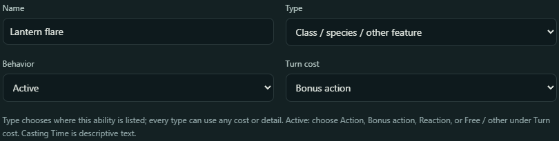

## Spending controls and concentration flag

**Spend a standard spell slot** enables slot spending for an ability with a level above zero. A cantrip or None does not spend a standard slot. The use dialog offers eligible slot levels; select the level you actually spend. The selected slot does not calculate upgraded damage or effects.

**Concentration** includes this ability in concentration selection and updates the tracker after a successful active use. If already concentrating, the warning lets you cancel or replace the previous focus. Merely viewing or selecting concentration manually spends no costs. A currently concentrated ability must stop being the selected focus before you save it as passive-only.

**Linked resource pool** and **Charges spent per use** charge the chosen character's pool. Create that pool first. Leave the link at No resource cost if none is needed. Costs can combine: one action, one slot and two charges can all be spent by the same use. To replace standard slots with a custom pool, explicitly turn standard-slot spending off.

**Mark unavailable for this character** disables ordinary active use until you clear it; rests do not clear it. A gray Use button can also mean the turn counter, slot or resource is exhausted. Read the reason and correct the actual cause instead of changing Type.

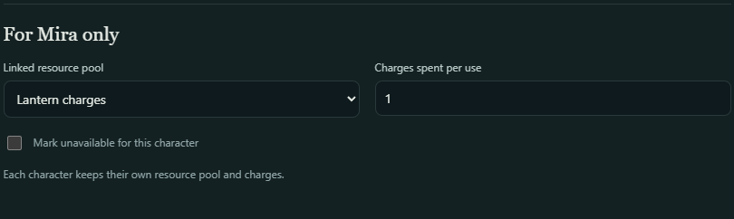

# 7. Passives and mixed abilities

## Choose the right reminder

| Representation        | Use it when                                                                                 |
| --------------------- | ------------------------------------------------------------------------------------------- |
| Passive, tracking off | The written reminder always applies. It shows Always applies and no switch.                 |
| Passive, tracking on  | A circumstance changes whether the reminder applies. Each assignment starts Inactive.       |
| Passive + active      | One named ability has a passive benefit plus an actively used effect with costs.            |
| Condition             | You want to add/remove a reusable status from a character, separately from their abilities. |
| Concentration         | You want to record the one currently concentrated ability and receive the damage reminder.  |

Passives begin with your descriptions. They do not grant AC, adjust HP or movement, modify skills, spend resources, add conditions, or enforce rules. Active/Inactive is a reminder, not automatic rule evaluation.

## Flag an ability as passive

1. Select the character, open **Passives**, then **+ Add** and **Create new**. To change an existing entry, choose its **Edit** control instead.
2. Set **Behavior** to **Passive**. Choose whichever Type describes its source/grouping; the Passives section is determined by Behavior.
3. Write its **Passive effect** and optional Reference. Leave **Track whether the passive applies** off for Always applies; turn it on for a circumstance you will track manually.
4. Save. A shared entry updates every linked character; a local entry changes only this character. Cancel leaves the saved ability unchanged.
5. Open **View** to read it. Confirm that the passive view has no ordinary Use button or action, slot or resource cost.

Switching Behavior retains previously entered active text and costs for a later switch back; they cannot be spent by passive-only use. If the app says this ability is currently concentrated, end/change that concentration before saving the passive conversion.

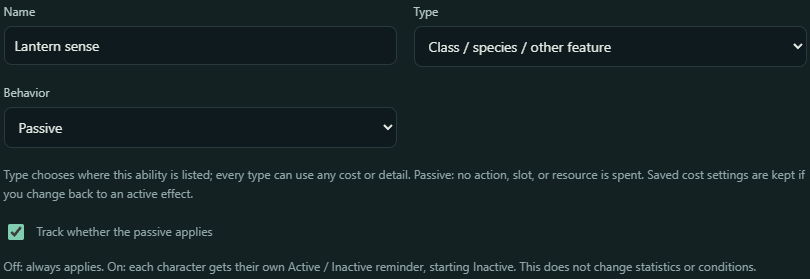

## Share Lantern sense without sharing its state

Assign Lantern sense to Mira and Rowan using the library. Both begin Inactive. On Mira's **Passives** tab, choose **Inactive** to mark it Active when she carries a lit lantern. Rowan stays Inactive. Changing the shared words changes both descriptions; it does not copy Mira's reminder state onto Rowan.

The switch is available in the DM list and passive View, the player Passives list/detail, and the DM's Currently displayed controls. With full click-through enabled, players see the status but the DM operates the switch from the laptop. Always applies entries do not offer a switch.

Rests do not decide whether the circumstance applies. Removing and reassigning is a new assignment; conditional reminders start Inactive. Switching tracking off retains the previous state if you turn it back on. Undo can reverse a saved reminder change during the session.

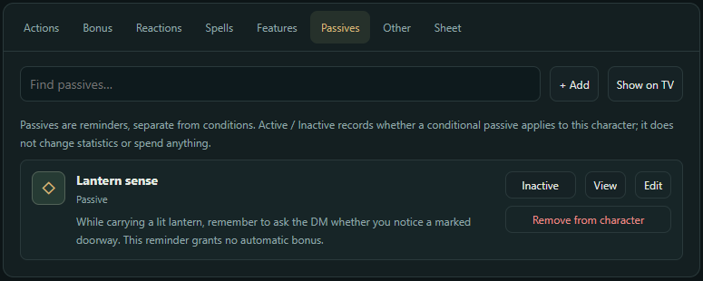

## Let players read passive effects

1. Expand the player's portrait and choose **Passives**, beside Features. Choose **View** beside the ability.
2. Read the effect. Use Previous/Next for long text and **Back to list** to return. A conditional reminder can be changed here when HUD controls are on.
3. From the laptop, use **Passives**, **Show on TV**, or **Show passive effect on TV** from the View dialog. **Currently displayed** provides matching selection and page controls.

The global Show TV overlay setting still controls whether the TV window is visible. A collapsed portrait has no room for the passive description; expand it to read. Unrelated updates preserve the selected effect/page; if that effect is removed, the HUD returns to its list.

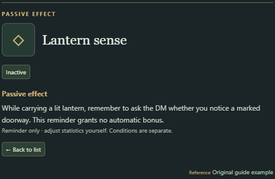

## Write a mixed ability

Use **Passive + active** for the original Watchkeeper example. Write “Remember the doorway you are watching” in Passive effect, and “Point out a change you have noticed; resolve its effect with the DM” in Active effect. Choose Reaction as the Turn cost. Keep tracking off if the reminder always applies.

Watchkeeper appears in Passives for the reminder and the active lists for its reaction. **View active effect** and **View passive effect** change the text view without spending anything. Only the active view offers Use and its costs. Both effects belong to one ability. Shared entries update both views for linked characters; local entries stay personal.

A conditional passive being Inactive does not automatically prohibit the active effect. If the rules require a restriction, the DM decides it; the reminder switch is deliberately independent of active-use availability.

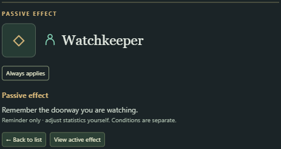

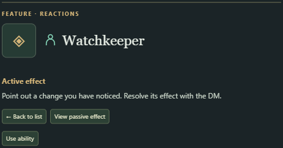

# 8. Slots and custom resources

## Standard slots or a custom pool

Use standard slots for the level-1 through level-9 counters shown on the character sheet. Set their maxima in Edit character. During a spell use, select an eligible available level in **Spend a spell slot**, then **Cast & spend** on the DM screen. On the player HUD, select the level and submit the cast request for approval.

Use a custom resource for charges, special casts, ammunition or any limited pool that does not fit standard slots. The pool name is yours; the app does not infer recovery from a class name. An ability can use a custom pool alongside or instead of standard slots.

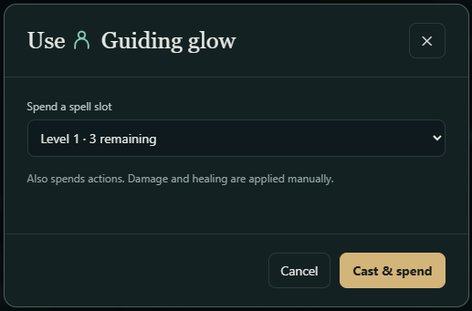

## Create, edit and correct pools

Use **Add** in the DM’s **Custom resources** section to open a dedicated form for that character. You can also add and edit counters in **Edit character to Custom resources**, immediately below spell slots, using **+ Add resource**. Give it a name, maximum amount, available amount, reset rule, shape icon, and color. Choose a circle, square, diamond, triangle, hexagon, or star. Raising a maximum adds available charges; lowering it caps the available amount. You can enter an available amount directly.

| Reset rule | What refills it to the maximum                                            |
| ---------- | ------------------------------------------------------------------------- |
| Short rest | Short rest or Long rest                                                   |
| Long rest  | Long rest only                                                            |
| Per turn   | Start turn for that character, including Next turn when their turn begins |
| Manual     | Its Reset button on the DM screen or interactive TV HUD                   |

Custom resources appear below spell slots in a clearly bordered section. Conditions and spell slots also have their own borders. Pools with a maximum of 10 or fewer show individual filled and empty charge markers, like spell slots; larger pools show current/maximum. This applies on both the DM screen and the overlay. Use **- / +** to spend or restore a charge; manual pools also have **Reset**. Each overlay resource page shows up to three counters, and the frame grows without scrollbars. The right-side Resources section uses the same page.

Edit names, amounts, reset rules, icons, or colors in **Edit character**. **Remove resource** removes a counter when you save the character. A resource linked to an ability must be unlinked from that ability first. **Cancel** discards your draft edits; **Undo** can reverse a saved change. Up to 60 counters can be stored on each character. Existing resource pools keep their counts and ability links after upgrading.

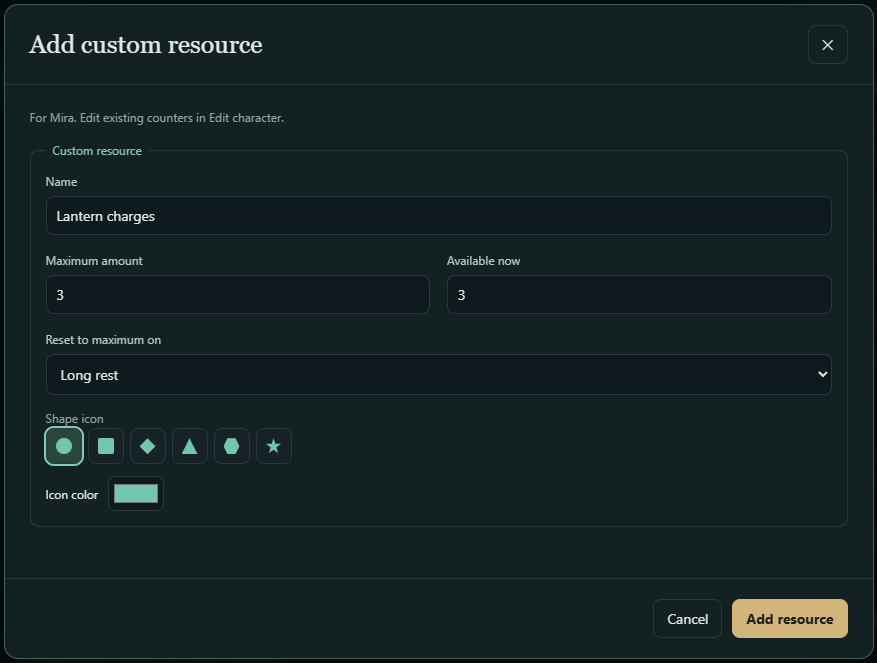

## Worked pool recipes

**Three lantern charges:** Add Lantern charges with maximum/available 3 and Long rest. Link Lantern flare with cost 1. Three affordable approved uses empty the pool. Long rest restores it; Short rest does not.

**Two special casts:** Create a maximum-2 Long rest pool. Make a local copy of the spell, uncheck Spend a standard spell slot, and link the pool at cost 1. Keep the original shared spell for ordinary slot casting. Check which version you choose before using it.

**Partial recovery:** Choose Manual if the rules recover only some charges. Use plus to restore the allowed number. Reset fills the entire manual pool, so use it only when full recovery is intended.

**Per-turn counter:** Choose Per turn when Start turn should refill it. Merely selecting a character does not start their turn. A Long rest does not refill manual or per-turn resource pools; Start turn handles the latter.

# 9. Turns, damage and corrections

## Select a character and start a turn

The party list on the left is the turn order. Drag players to new positions or use their **up / down** arrows. Choose **Initiative order** to enter each roll, then **Sort highest first**, or arrange the order with the dialog’s arrows. Click **Save order** when ready.

**Next turn** advances through this visible order and wraps back to the top after the last character. Reordering keeps the active player’s turn, resources, and the TV’s separate positions and rotations. Use **Start turn** if you want to begin with a different player. Adding a party member puts them at the bottom; editing their name or initiative value does not automatically reorder the party.

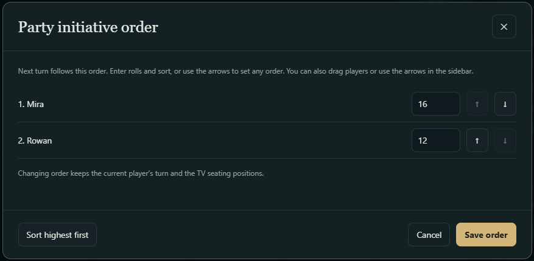

**Start turn**, **Next turn**, **Short rest**, and **Long rest** sit above the selected player's
portrait and name. Character controls sit beside the name, with **Currently displayed** at the
upper right.

**Abilities** shows ability scores, modifiers, armor class, proficiency, and initiative directly
above the matching compact tiles for hit points, action, bonus action, reaction, and movement.
**Concentration & conditions** sits directly below those counters, followed by the ability and feature tabs. The right column stacks
**Currently displayed**, spell slots, and custom resources with no empty space between sections.

**Start turn** restores the selected character's action, bonus action, reaction, movement and Per turn pools. It also makes that character the current turn. **Next turn** moves through the party order and starts the next character. Only active members participate. Starting a turn may warn about waiting requests that would expire; read the list before continuing.

## Turn counters and manual movement

Action, Bonus action and Reaction each have **Spend / Restore** for a manual correction and **Show options** to display matching choices on the TV. These corrections do not apply an ability's effects. **Movement -5 / +5** adjusts remaining feet; **Set** enters a value directly. Tablelight does not track a token's path or measure distance on the map.

Use **View** to read an ability. DM **Use** spends its configured costs immediately; player **Use ability** requests approval. Confirm a slot choice or concentration replacement when offered. Gray/unavailable choices show that a cost or manual availability setting prevents use. All damage, healing and other effects still need your ruling and manual application.

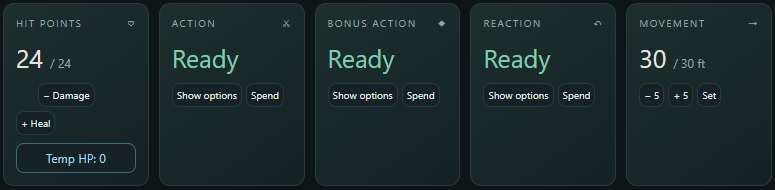

## Damage, healing and temporary HP

1. Select the character. Choose **- Damage**, enter the amount and choose **Apply**. Damage consumes temporary HP first, then regular HP, stopping at zero.
2. For healing, choose **+ Heal**, enter the amount and Apply. Regular HP cannot exceed Maximum HP; healing does not add temporary HP.
3. Choose **Temp HP: [value]** to set or clear temporary HP directly. Enter the total that should remain, not an amount to add to the existing pool.
4. Use Undo immediately for a mistaken operation, or correct the intended values explicitly. If concentrating, resolve any required save yourself; the amber icon is a reminder only.

**Example:** With HP 24 and Temp HP 4, applying 7 damage clears the 4 temporary HP and leaves regular HP 21. Healing 10 then caps regular HP at 24. Applying damage never automatically ends concentration, even if regular HP reaches zero.

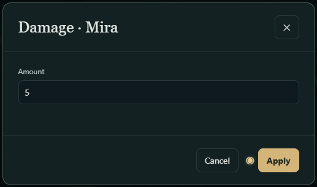

## Short rest and long rest

1. Choose **Short rest** or **Long rest** above the selected character's portrait.
2. Check **Who is resting?** Select the character or **The whole party**. Saved players outside the active party are excluded from the whole-party choice.
3. Read the summary, then **Apply rest**. Cancel spends/changes nothing. Use Undo during the session if you selected the wrong scope.

| Result                                           | Short rest / Long rest                                                        |
| ------------------------------------------------ | ----------------------------------------------------------------------------- |
| HP                                               | Short: unchanged; apply healing manually. Long: restored to maximum.          |
| Temporary HP                                     | Short: unchanged. Long: cleared.                                              |
| Standard slots                                   | Short: unchanged. Long: full.                                                 |
| Action, bonus action, reaction, movement         | Short: unchanged. Long: restored.                                             |
| Short-rest pools                                 | Refilled by either rest.                                                      |
| Long-rest pools                                  | Refilled by Long rest only.                                                   |
| Manual and Per turn pools                        | Not refilled by either rest. Use manual controls or Start turn as configured. |
| Concentration                                    | Short: unchanged. Long: ended.                                                |
| Conditions, passive reminders, unavailable flags | Unchanged by both rests; decide and change them yourself.                     |

These are Tablelight's tracker operations, not an interpretation of every game system's rest rules. If your rules differ, use manual corrections and suitable pool reset rules.

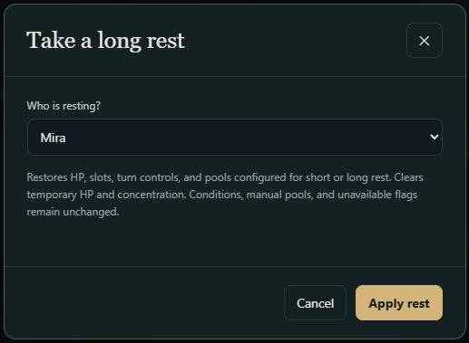

## Ordinary Undo

The top-bar **Undo** or **Ctrl + Z** reverses the last Tablelight change when you are not typing in a field. Up to 40 recent changes are kept during this session. Text editing uses normal text Undo while a field has focus. Ordinary Undo can reverse saved character/library edits, spending, rest operations and a confirmed restore.

# 10. Player requests and History

## Review and approve a request

Using an ability from a player's overlay now requests DM approval. Choose the spell-slot level
first if needed. The HUD reserves the action, bonus action, reaction, slots, and linked charges
for that request, showing what would remain if all pending uses were approved. The DM's actual
counts stay unchanged until **Allow use**. Pending uses appear in their own column to the right
of the ability browser. Each pending use has its own **Cancel** button; the column disappears
when that character has no waiting requests.

The **DM queue** icon sits at the bottom right of the DM screen. It pulses and shows **!** while
requests wait. Open it to choose a request and read the same ability details as View, together
with the costs that approval will spend. Choose **Allow use**, **Deny use**, **View character**, or
**Minimize**. View character opens the character's DM page and keeps the request queued. Close
and Escape also minimize. Finishing a request does not automatically open the next one.

The first request opens automatically only when no popup or earlier request is waiting. Incoming
requests never replace an open editor. Close the current dialog before opening the queue. At most
three ordinary ability requests can wait across the party. A fourth shows **Hold up - the DM is super
busy!** Affordable reactions are exempt, appear in red as **Urgent**, and sort first.

If an edit changes data that a request depends on, a warning lists the affected requests. Continue
applies the change and denies them; Cancel preserves both the edit form and the requests. Starting
a new turn similarly warns before expiring that character's requests. Unrelated changes can continue.
If already concentrating, the player sees a warning before requesting the new ability. The DM sees
that warning too; concentration switches only on approval.

DM-console ability uses remain immediate. Damage, healing, and ability effects remain manual.
Requests survive reloading a window but clear when Tablelight closes. Approved costs stay saved.
Open the **History** icon at the bottom of the DM screen, just to the right of the sidebar, to see the five most recent resolved
requests. Each entry shows its outcome; open it to read the ability details recorded with that
request and the costs actually spent. Older entries drop off without changing any counters.

Denied, player-canceled, and expired requests offer **Reconsider**. This creates one new request
at the front of the queue and opens it immediately, using the current ability and costs. Urgent
reactions stay ahead of ordinary requests. The earlier entry is marked Reconsidered so it cannot
queue another copy. Unavailable abilities, invalid old slot choices, and a full queue show why
Reconsider is disabled; submit a fresh request with a valid slot when needed.

Approved requests offer **Undo this use**. It refunds only that use’s recorded costs and restores
its previous concentration when safe. Later tracked ability spending, HP changes, and other
unrelated work remain intact. For example, spend two charges, then one more: undoing the first
use returns two charges while leaving the later one spent. A reset, manual correction, capacity
change, or later concentration change can disable the whole refund, with a reason beside the
button. If pending requests rely on counters being refunded, the existing warning lets you
cancel or continue and deny those dependent requests.

A refunded request is marked **Undone** and cannot be refunded or reconsidered again. Ordinary
**Undo** also updates these labels; undoing a targeted refund restores that use’s costs and Allowed
status. History and the queue survive window reloads but clear when the app closes. They are never
included in exported backups.

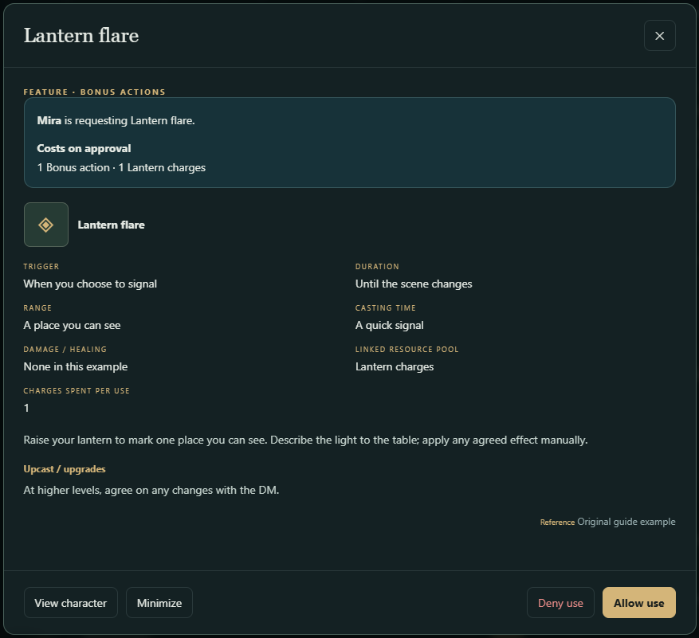

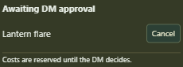

## Practice denial and reconsideration

1. With an affordable ability selected on the TV, choose Use ability. On the DM review choose **Deny use**.
2. Confirm actual counters stayed unchanged and the pending player card disappeared.
3. Open **History**, select that denied request, and inspect the stored description. Choose **Reconsider** if available.
4. Review the newly queued request, which uses the current ability and current costs. Allow or deny it normally. The original history entry cannot create a second reconsideration.

**If Reconsider is unavailable:** Read its reason. Start a fresh request when the previous slot level is no longer valid, the current ability is unavailable, or the queue has no room. Reconsider does not bypass affordability or approval rules.

## Refund one approved use

1. Open History and select an allowed request. Check the exact Costs spent shown with it.
2. Choose **Undo this use** if enabled. Review any warning about dependent pending requests; Cancel leaves them unchanged, Continue denies those that depend on the changed counters.
3. Confirm only the recorded costs return. Other tracked uses, HP changes and unrelated work stay intact. The history label becomes Undone.

**Example:** A first allowed ability spends two charges, then a later one spends one. Refunding the first returns two while the later charge stays spent. If someone manually corrected or reset that pool after the first use, the safe refund may be disabled. Correct the intended state manually in that case; do not assume an old use still owns the current counters.

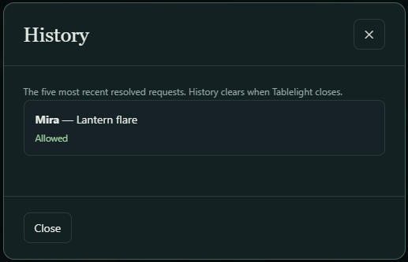

# 11. Concentration and conditions

## Concentration selection and replacement

In an ability's editor, check **Concentration** for any action, spell, or feature that needs it. This checkbox applies to every turn cost and defaults off. It is part of the shared library entry, so edits apply to every character using that entry.

The expanded HUD has a **Concentrating** icon below the ability scores. With **HUD controls: on**, click the unlit icon to open a searchable list of this character's assigned abilities that are marked Concentration. Choose **Concentrate** beside an ability to light the icon. Hover over it to read the selected ability's name. Click the lit icon again to end concentration. **Cancel** closes the list without changing concentration. If the list is empty, flag the appropriate abilities in their editors on the DM screen.

The DM character page has the same toggle plus **Choose ability / Change ability**. Both screens include all flagged ability types, including bonus actions and reactions. Selecting one records concentration without spending an action, slot, or charge. Use the normal ability controls to spend costs separately.

The selected ability is saved by its character assignment, so renaming its shared entry updates the hover name. Removing that ability from the character or turning its concentration flag off ends concentration on it. Long rest ends concentration; short rest, Start turn, damage, and using abilities without the concentration flag leave it as set.

Using an ability marked **Concentration** automatically selects that ability in the concentration tracker after its use is validated. This applies to spells, actions, and features, including cantrips and abilities that use custom resources. If the character is already concentrating, an **End current concentration?** warning opens on the screen where you clicked Use. It names the old ability, or says **your current ability** when no name is recorded. **Cancel** preserves the old concentration and spends nothing; **Use ability** spends the normal action, slot, and resource costs and switches concentration to the used ability. This also applies when using the same concentration ability again. On the TV, the warning stays inside that character's rotated HUD. Failed uses leave concentration and costs unchanged. **Undo** restores the previous concentration and all costs from that use together. The manual Choose ability / Change ability controls remain available for corrections.

While a character is concentrating, an amber concentration icon pulses beside the DM's **- Damage** button, **Apply** in the damage dialog, and the interactive HUD's **HP -1 / -5** buttons. Hover over it to see **Concentrating: [ability name]**, or **Concentrating** when no name is recorded. The icon updates as concentration changes, including while the damage dialog is open. It is only a reminder: damage applies normally, with no additional confirmation, automatic roll, or change to concentration. The icon stays steady when reduced motion is enabled in your system.

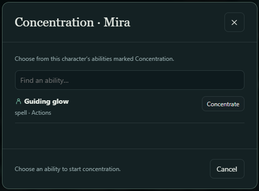

## Apply and remove conditions

Open **Condition library** in the sidebar to create, search, edit, or delete conditions. Each definition has only a name and description. The library starts empty. **Assign** adds a definition to an active or saved character.

On the DM character page, click **Add** beside Conditions. Search saved names or descriptions, then click **Add** beside an entry to apply it. **Create new** lets you write a new name and description; **Save & add** saves it to the shared library and applies it to this character together. **Cancel** leaves both unchanged.

With HUD controls on, the expanded TV HUD also has **Add** beside Conditions. Its searchable menu only offers existing library entries. It stays within the character's rotated HUD and keeps the same HUD size. Already-applied entries show **Added**. You can add several conditions, then choose **Done**. Create any new definitions from the DM screen.

Applied conditions appear under the **Conditions** heading on the expanded HUD. Hover over a name to read its description when HUD controls are on. Remove a condition using the DM's **Remove** button or the **×** beside its name on the interactive HUD. Removing an assignment keeps the definition in the library. Shared edits update every assigned character, including players outside the party. Remove all assignments before deleting a library definition; deletion supports confirmation and Undo.

Conditions remain until you remove them, including after rests. Upgrading preserves old condition text as one reusable entry per distinct note, so any qualifiers you wrote stay intact. You can edit or split that entry yourself in Condition library. Existing concentration notes remain visible until you end concentration or choose an ability; the app does not guess which abilities need a concentration flag.

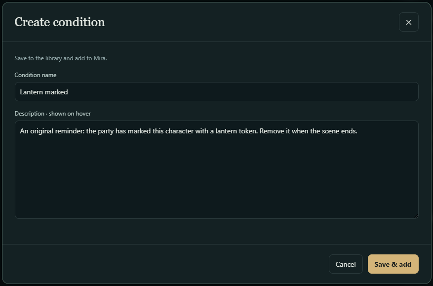

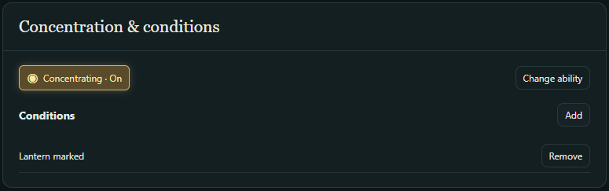

## Worked reminder: Lantern marked

1. On Mira's DM page choose **Add** beside Conditions, then **Create new**. Name it Lantern marked and write “Remove this lantern-token reminder when the scene ends.” Choose **Save & add**.
2. Open Condition library. The definition now exists independently and can be assigned to Rowan or a saved character. Edit its description to update everyone using it.
3. On the interactive player HUD choose Conditions **Add**. Search existing definitions, add one or more, then choose **Done**. The TV cannot create a new definition; return to the DM screen for that.
4. After a rest, inspect the condition. It remains because conditions have no automatic expiry. Remove it manually when the scene ends.

The TV shows six conditions per page, and its picker shows five choices per page. Use Previous/Next rather than looking for a HUD scrollbar. Descriptions appear on hover when interactive controls are on. For full click-through, read/manage them on the DM screen.

To delete a condition from the library, first remove its assignments, including inactive characters. The library's Assign control includes saved players; delete only after the app no longer reports users. Undo can restore a confirmed deletion during the current session.

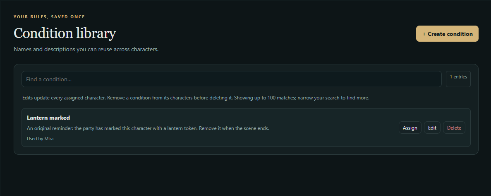

# 12. Player HUDs and TV layout

## What appears on an expanded HUD

Expanded HUDs use a wide layout. Portrait, character name, HP, AC, actions, movement, ability scores, conditions, slots, custom resource counters, and Smaller/Larger controls are on the left. Conditions show six entries per page in two rows of three. Custom resources show three entries per page. Both have Previous/Next controls. Resources sit below slots; long names wrap. **Overview, Action, Bonus action, Reaction, Free / other, Spells, Features, Passives, Sheet, and Resources** are at the top of the right column, with the selected section's data directly underneath. Sheet shows skills and saves beside the main character controls instead of adding them below. Descriptions, resource controls, and page buttons stay in that same right column.

The overlay never uses scrollbars. The HUD and message panels grow taller to show their current page in full, including ability lists, descriptions, and resource counters. Pending DM approvals add a separate column on the far right, keeping the ability browser’s width unchanged. All columns move, rotate, and resize together at your chosen scale. Collapsing still returns to the small portrait bubble. The laptop’s TV preview shows the same arrangement.

When HUD controls are on, expanded HUDs can show options and full descriptions, spend actions or bonus actions, adjust HP and movement, use spell slots or custom resource pools, and start a new turn. These actions also update your laptop and save to the same party.

Click an option to show its description. Use **Use ability**, or **Cast L…** for a spell, to request approval and reserve its costs. Apply any additional ability effects yourself as before.

Only the bubbles and their panels receive clicks; blank map areas remain click-through. Use the laptop’s **HUD controls: on / Click-through** button, or **Ctrl + Alt + I**, to switch to full click-through mode. In that mode the section labels and current data remain visible, while interactive controls disappear and clicks on the HUD reach the map. All laptop controls continue to work.

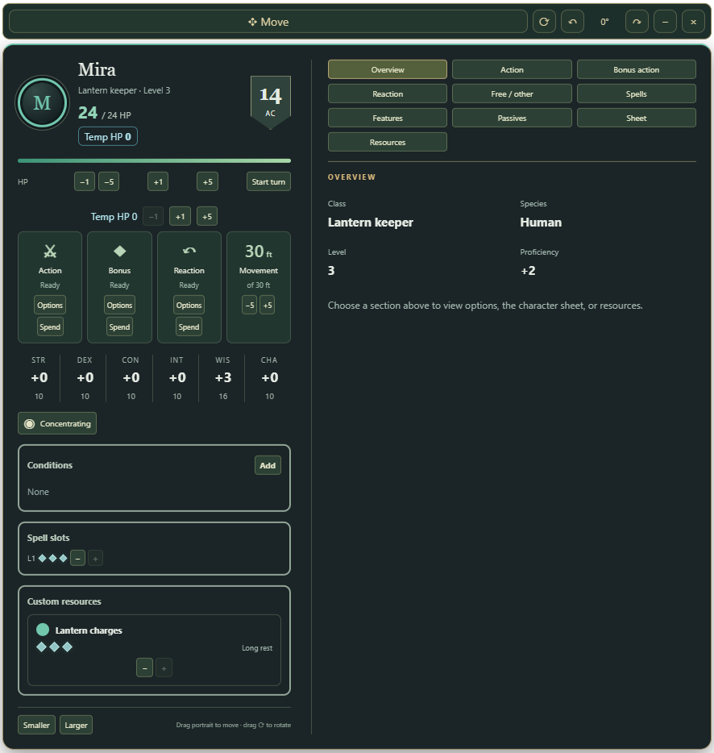

## Every player section

| Section                                      | What it is for                                                                     |
| -------------------------------------------- | ---------------------------------------------------------------------------------- |
| Overview                                     | The character's general overview and shortcuts to their options.                   |
| Action; Bonus action; Reaction; Free / other | Active abilities matching that turn cost, across Types.                            |
| Spells                                       | Active spell entries, regardless of their action cost.                             |
| Features                                     | Active class/species/other feature entries.                                        |
| Passives                                     | Passive and mixed abilities' passive effects, with personal reminder status.       |
| Sheet                                        | Skills and saving throws with P/E controls when interactive. DM notes are omitted. |
| Resources                                    | Custom resource controls; shares the resource page with the summary counters.      |

Ability lists show fifteen entries per page. Conditions show six, custom resources three, and in-HUD choice menus such as conditions/concentration show five. Description text uses pages tailored to its length. **Previous / Next** applies to the current list or detail. **Back to list** closes a description without spending anything.

The left summary also offers HP minus/plus in 1 or 5 increments, temporary HP adjustments, action/bonus/reaction spending and restoring, movement controls, slot counters, resource controls, Start turn, and Smaller/Larger sizing when interactive. A portrait click expands/collapses; expanded Move and rotation handles control placement. The pending approval column appears only while requests wait.

These direct changes update the same character on the laptop and save to the same party. Only ability use is subject to the DM approval queue; ordinary HUD counter adjustments remain direct.

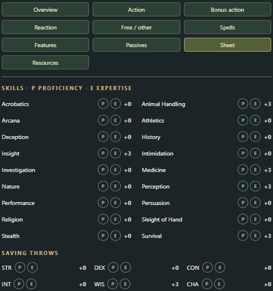

## Placement and scale

Every character has their own position, rotation, size, and visibility. Moving one never moves another.

- **On the TV:** leave **HUD controls: on** enabled in the laptop’s top bar. Drag a character’s portrait to move their bubble. Drag their **rotation handle** to rotate freely, or use **rotation arrows** to rotate in 15° steps. Hold Shift while dragging the rotation handle to snap to 15° increments.
- **Expand:** click a TV portrait or its + button. Its HUD keeps the same rotation. Expanded HUDs have their own **Move** handle, rotation controls, collapse button, and hide button.
- **On the laptop:** use **Position & rotate** or **TV & layout**. Drag individual portraits and use their rotation controls in the preview. The right-hand panel still offers exact position, degrees, and size controls for the selected player.
- **Show or hide one player:** use **Show this bubble / Hide this bubble** on their laptop character page, their visibility checkbox in TV & layout, or the expanded HUD’s × button.

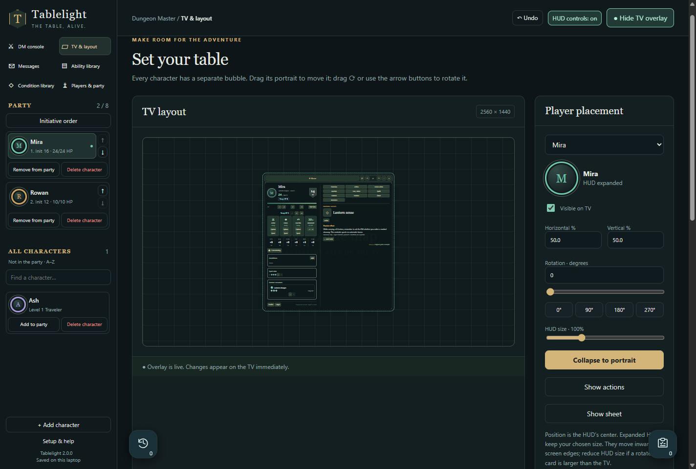

The selected player's **Horizontal %** and **Vertical %** specify the HUD center. Enter exact values when dragging is inconvenient. **Rotation - degrees**, its slider, and 0/90/180/270-degree buttons give exact orientation. **HUD size** ranges from 40% to 250%; it belongs to this character only.

**Arrange around TV** distributes the active party facing outward. Review individual positions afterward. It does not invite saved players into the party or change initiative. **Visible on TV** controls this player; **Show TV overlay** controls the entire overlay window. A player can be individually hidden while other HUDs remain visible.

Global **HUD background opacity** ranges from 40% to 100%. Increase it for text contrast over a busy map. **Expand one player at a time** collapses other expanded players when you expand one; leave it off to keep multiple HUDs open.

Expanded HUDs retain their chosen scale and rotation across section changes. They can grow taller for more content and move inward near display edges. They do not automatically shrink to fit a rotated card. If a large card extends beyond the TV, reduce its size or reposition it deliberately.

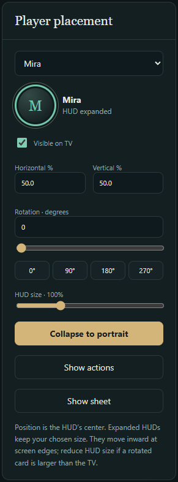

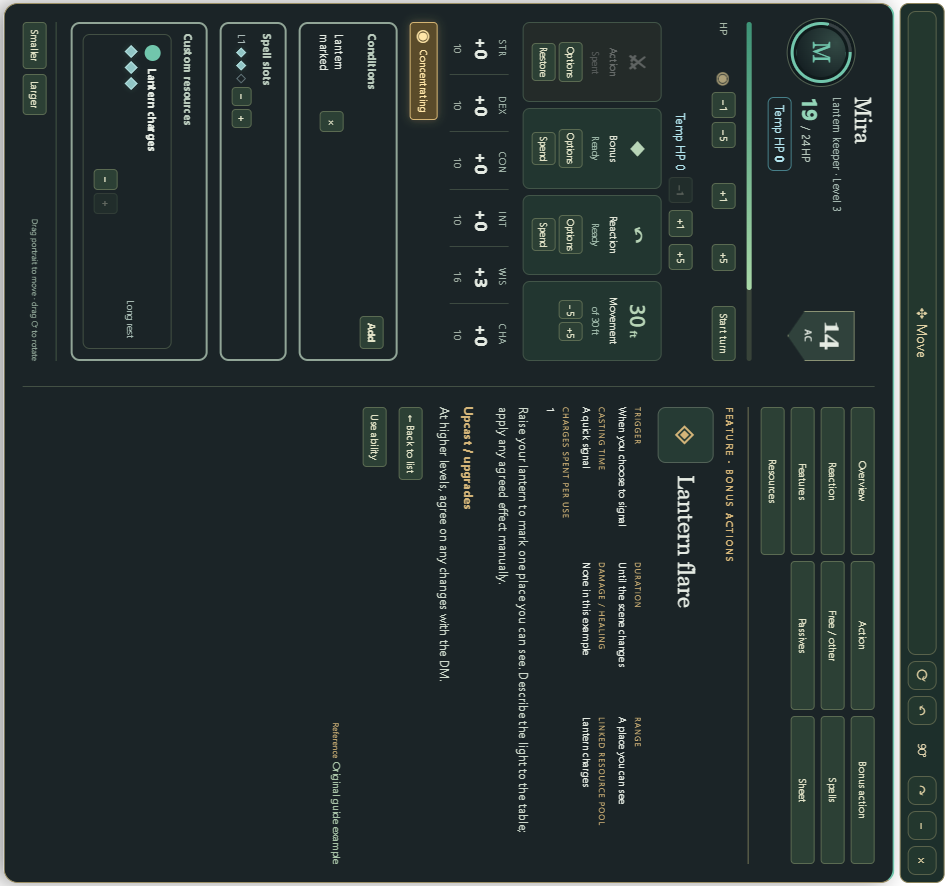

## Remote control from Currently displayed

The DM’s character page has a **Currently displayed** panel at the top of the right column. Its tabs match the expanded TV overlay: Overview, Action, Bonus action, Reaction, Free / other, Spells, Features, Passives, Sheet, and Resources.

Ability lists show up to **fifteen entries per page** on both screens. Longer lists use Previous/Next.
The frame grows downward to fit each page. In click-through mode, use the DM page controls.

Action-cost tabs include every matching ability, including spells and class features. For example, Bonus action includes your bonus-action spells. Click an ability in the DM panel to open its description on the TV. **Previous / Next** page through longer lists or descriptions. **Back to list** returns from a description. Clicking the TV tabs updates the DM panel too.

**HUD size** changes only this player’s size, from 40% to 250%. Use the slider, Smaller, Larger, or 100%. It stays in sync with TV & layout. The chosen scale stays exactly the same across menus and rotations. If a card is too large for the display, reduce its size yourself.

Use **Previous / Next** in Currently displayed for ability lists, details, and the Resources section. The DM’s Conditions and Custom resources cards also have **TV** page controls when there are more than six conditions or three custom resources. Each player keeps independent page selections. These controls work while the overlay is hidden, collapsed, or click-through; changing a list page does not reveal a hidden player.

The panel indicates whether the TV overlay, player, or expanded HUD is hidden. Choosing a tab expands that character’s HUD; the global Show TV overlay button still controls whether the TV window is visible.

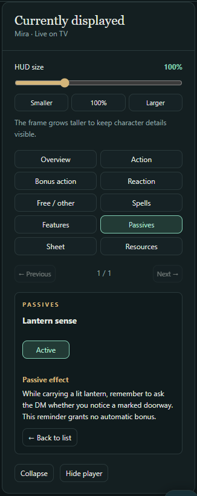

## Click-through and shared-screen habits

Use the top-bar **HUD controls: on / Click-through** button, **Interact with HUDs directly on the TV** in TV & layout, or **Ctrl + Alt + I**. Interactive mode gives only HUD regions control of clicks; empty map space still passes through. Full click-through removes interactive HUD controls and passes all clicks to the map, while retaining the current information and section labels.

The DM can still choose sections, page details, adjust reminders and counters, and open/close messages from the laptop. Set the desired TV content before turning click-through on if players will be moving map tokens through those areas.

Before a session, read the smallest label from each seat. Rotate toward the player, increase scale when space permits, and use higher background opacity if the map makes text hard to read. Avoid placing two expanded HUDs over the same region; messages can bring their selected card to the front but do not rearrange the party.

# 13. Messages to players

## Send, read and manage a note

1. Open **Messages** in the left sidebar and choose an active player. Check the name and portrait
   beside **Send message**, especially when characters have the same name.
2. Write up to **2,000 characters**, then choose **Send message**. Each player has their own draft;
   switching players or leaving this page keeps unfinished text during this session.
3. The player's bubble or expanded HUD gains an envelope with an unread dot, without a text
   preview. It pulses gently for five seconds, then stays steady. Windows reduced-motion settings
   keep it steady from the start. Sending never shows a hidden player or exposes the note automatically.
4. With HUD controls on, the player clicks the envelope to read the message. It faces the same
   direction as their character. Use the page arrows, then **Close**. The message panel grows to show the current page without scrolling.

**Opened messages are visible to everyone near the shared TV.** Recipient selection controls where
the note appears; it cannot make an opened message private from other people at the table.

The DM's **Force open** reveals the selected player's note. **Previous page**, **Next page**,
and **Close on TV** also work in click-through mode, without turning
player controls back on. If cards overlap, Force open brings the selected message to the front.
The reading panel fits within an expanded HUD, or appears as a temporary card for a collapsed
player. Closing restores access to the same bubble/HUD without changing its saved settings.

**Sent** means accepted by Tablelight. **Delivered · Unread** means the envelope reached the
visible overlay. **Opened by player/DM** means the overlay displayed the text; it is not proof
that someone read it. **View sent text on laptop** lets the DM review a note without marking it
opened on the TV. The layout preview shows notification state only.

There is one retained message per player. Sending another requires **Replace** confirmation,
which discards the old note and makes its replacement unread. **Close** retains the note for
reopening; **Dismiss** removes it. A failed send keeps the draft for retry. A failed text load offers
**Retry** on the TV; the DM can also use Force open again.

Hiding the player/TV, changing between collapsed and expanded HUDs, dragging the HUD, or reloading
the overlay closes exposed text. Showing the player again restores the envelope without reopening
the message. Show hidden players through **TV & layout** before using Force open.

Messages and drafts stay in memory during this session. They are excluded from party saves,
backups, and gameplay Undo. Restarting Tablelight or successfully restoring a backup clears them.
Removing a player clears their sent message; rejoining or Undo does not bring it back. Ordinary
stat, theme, and library edits retain other messages and each player's independent settings.

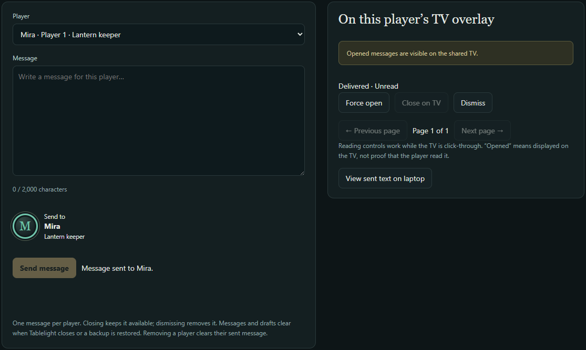

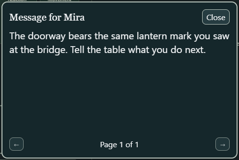

## Worked message: a clue at the doorway

1. In Messages select Mira. Write “The doorway bears the same lantern mark you saw at the bridge. Tell the table what you do next.” Check the displayed recipient and choose **Send message**.
2. With the player and overlay visible, confirm **Delivered - Unread**. Mira opens the envelope when ready, or the DM chooses **Force open**.
3. Use Previous page/Next page for a long note, then **Close** or **Close on TV**. Reopen the envelope to read the same note again.
4. To send a revised clue, edit the draft and Send. Review the replacement prompt. **Keep previous message** cancels replacement; **Replace for Mira** discards the old note and makes the new one unread.
5. Choose **Dismiss** when the note is no longer needed. For an important campaign record, separately copy its text to your notes before closing Tablelight.

**Check:** View sent text on laptop does not mark the message opened on the TV. Force open does. Sent/Delivered/Opened describes display delivery, not proof that the player read or understood the message.

If Force open is unavailable, show the selected player in TV & layout and show the overlay. If text loading fails, use Retry on the TV or try Force open again.

# 14. Setup, saves and recovery

## Setup and the offline guide

**Setup & help** brings together installation/display steps, library and cost advice, the manual-tracker explanation, Read license, backup export/restore, saved party folder, update preferences, keyboard controls and display tips. Use this page for setup, backups and access to the full guide.

Choose **Open illustrated user guide (PDF, offline)**. Windows opens the guide stored inside this running installation using your default PDF viewer. It does not require internet, write a save, spend a resource or change Undo. The link does not download a newer manual. Its text and screenshots must match the installed build.

If opening fails, read the message beside the link. For a missing/unreadable guide, repair or reinstall that version. For no working viewer, choose a PDF app in Windows and retry. Repeated clicks while it is opening do not launch multiple requests. The link becomes available again after an error.

## Automatic saving and backup contents

Changes save automatically in **%APPDATA%\Tablelight\party.json**, with a previous-save backup in the same folder. Portraits and the shared library are included. The library is independent of characters, with both saved together so backups stay complete. Closing Tablelight hides the TV overlay; it starts hidden next time.

Use **Setup & help to Export party backup** to save every player, active party membership, portraits, and the shared library together. Transfer that file to another laptop and use **Restore backup**. Restoring replaces the entire current roster, party, and library after confirmation. Export before restoring if you want to keep both collections.

This development branch writes save format 11 and imports formats 1-10. The new format preserves passive ability definitions and individual reminder states; the DM editor and Passives controls are available, and the player HUD Passives section is available. Backups also retain all manual ability fields, shared and character-only ability images, active and inactive players, both libraries, resources, and each character's theme and HUD choices. If a save came from the earlier calculation preview, explicitly entered fixed numbers are retained as Attack/Save text and personal exceptions become separate library variants. Automatic modes are removed. Released Tablelight 1.12.1 and earlier cannot read format 11; keep an exported backup from before using a development build if you may need to return to a released version. Pending approvals, History, player messages, and message drafts are session-only and are not included in saves or exported backups.

## Export a recovery copy

1. Open **Setup & help**, then **Export party backup** under Keep a backup.
2. In the save dialog, choose a folder outside the program installation, such as Documents. Use a recognizable date/session name. Save the file.
3. Keep an additional copy on your preferred backup storage if desired. The export includes the whole saved roster and libraries, not only the currently selected player.

Export before large library edits, restoring another party, moving computers, uninstalling with data deletion, or switching between a development build and an older release. Autosave and party.previous.json are useful recovery measures; they are not a history of every session.

## Restore or move to another PC

1. Export the current destination party first if you may want it later. Restore replaces, rather than merges, all saved players, active membership and libraries.
2. On the destination PC install a compatible Tablelight version. Open **Setup & help**, **Restore backup**, and choose the exported file.
3. Read the replacement confirmation and continue only for the intended backup. Cancel keeps the current party.
4. Check the roster, shared abilities, conditions, resource totals, portraits and themes. Re-select the TV and review seating because the other PC's display arrangement may differ.
5. Show the overlay when ready. Pending approvals, History, player messages and drafts are not restored. This computer's automatic-update preference remains separate from party backups.

A successful restore can be reversed with ordinary Undo during that session, but it clears messages; Undo does not reconstruct those messages. Keep the exported pre-restore copy for recovery after closing the app.

## Previous-save recovery and save failures

The current save is **party.json** and the previous valid save is **party.previous.json** in the Saved party folder shown in Setup & help (normally %APPDATA%\Tablelight). If the current save cannot be read and the previous one can, the app recovers it and tells you. Inspect the result and export a fresh backup before making large changes.

If both files cannot be read, the app preserves them and reports their folder. Close Tablelight, copy that folder to a safe backup location, and move the damaged party files aside rather than deleting your only copies. Restart with a fresh state and restore an exported compatible backup. Keep the original files for investigation.

If the sidebar says **Save failed**, do not assume the latest work is safely on disk. Keep the app open, check available disk space and access to the reported save folder, and use export if it succeeds. Resolve the error and verify saved status before closing. Avoid running multiple different builds against the same real party while testing.

## Privacy and retained state

| Stored with the party                                           | Only this session or computer                                                                                |
| --------------------------------------------------------------- | ------------------------------------------------------------------------------------------------------------ |
| Active and inactive characters, stats, notes and portraits      | Messages, message drafts, pending requests, five-entry History and 40-change Undo clear when the app closes. |
| Both libraries, unused definitions and local abilities          | Automatic update preference belongs to this computer, outside party backups.                                 |
| Personal resources, links, availability and passive states      | The TV overlay starts hidden each launch even though character layout is retained.                           |
| Theme, position, rotation, scale, visibility and HUD selections | Display hardware can differ after moving PCs; select the intended TV again.                                  |

DM notes are excluded from the player overlay but are included in exports. Handle a party backup as a copy of your campaign data. The guide and its example screenshots contain no real party data.

# 15. Updates, uninstall and included files

## Check and install updates

After the DM screen opens, installed copies check GitHub for a newer stable release. A new version offers **Update and restart** and **Later**. The prompt waits until an existing editor or dialog closes. **Later** leaves a small download arrow beside the sidebar version; click it to reopen the offer. **Release notes** opens the official release page in your usual browser.

**Update and restart** downloads and verifies the installer, saves the latest party, installs, and reopens Tablelight. The TV overlay starts hidden again. **Cancel download** keeps the current version open. If downloading or saving fails, Tablelight stays open and lets you retry. It never installs merely because you close the app or dismiss the offer.

Under **Setup & help to Updates**, turn off **Check for updates at launch** to stop automatic checks. **Check now** still works when this is off. Current versions and offline launches show no update popup; manual results appear in this section. The setting belongs to this computer and is separate from party backups and Undo.

Checks request only public release information from GitHub. Choosing Update downloads program files; no characters, portraits, party information, notes, or libraries are uploaded. GitHub receives ordinary connection information such as your public IP address. Play and saves work without internet. See **docs/UPDATES.md** in the included source for details.

The installer is currently unsigned. Windows may show an unknown-publisher warning or block it under stricter device policies. Download only from the official Tablelight repository. If installation cannot finish, keep your saved data and run the official installer again.

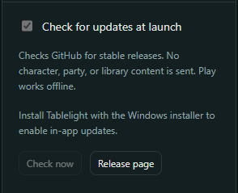

## A safe update routine

1. Finish and save any open editor. Export a backup before a major upgrade.
2. Review the offered version and Release notes. Choose **Later** to keep playing; use the sidebar download arrow to reopen the offer.
3. Choose **Update and restart** when ready. Keep the app open while the download verifies and the current party saves. **Cancel download** leaves the current version running.
4. After restart, confirm the title/sidebar version, open the guide from Setup & help, and check your characters. Re-select/show the overlay when ready; it restarts hidden.

Installed updates retain the chosen installation location and saved party data. If an update fails, the current app remains available for retry. An offline Check now can report a connection error; you can continue local play and check again later. A source checkout, portable copy or unpublished development build may not have the same update offer as an installed stable release.

## Uninstall choices

Close Tablelight, then use **Windows Settings to Apps to Installed apps to Tablelight to Uninstall**,
or run **Uninstall Tablelight.exe** in the installation folder.

The wizard removes the installed program, its shortcuts, and cached update downloads. Leave
**Remove all saved data** unchecked to keep your content and settings for a later reinstall.

For a fresh start, select **Remove all saved data** and confirm the separate deletion warning.
This permanently removes this Windows user's Tablelight characters, active party, saved roster,
ability and condition libraries (including unused entries), portraits, resources, spell slots,
concentration, notes, settings, update preference, and previous save. Export a party backup first
if you want a recovery copy. Keep exported backups in a separate folder, such as Documents;
files stored inside the installation folder are removed with the program.

Canceling the warning returns to the choice without uninstalling or deleting data. Updates always
keep saved data and do not offer this deletion choice. The uninstaller works offline. If files
are locked or a data folder contains a directory link, it reports incomplete cleanup rather than
following that link or claiming everything was removed. Other Windows users' saves and separate
portable/source copies are not removed.

## Included source and license

**Read license** in Setup & help opens the GPL-3.0-or-later license. The editable application source and guide assets are in **resources/app**; **START HERE.md** is the shorter companion. Font and dependency notices are included. No authoring tools are needed for normal use. The guide's original examples are not a bundled game rulebook.

# 16. Troubleshooting

## TV visibility and interaction

| Symptom                                  | Check and recovery                                                                                                                                                |
| ---------------------------------------- | ----------------------------------------------------------------------------------------------------------------------------------------------------------------- |
| Nothing on the TV                        | Choose Extend in Windows; select the TV in TV & layout; Show TV overlay; check the player's Visible on TV setting. The overlay starts hidden after launch/update. |
| Wrong display or lost TV                 | Refresh displays after reconnecting HDMI, choose the intended TV and show it again. A disconnected selected TV hides the overlay.                                 |
| Only a portrait is visible               | Click the portrait or Expand player HUD. Collapsed portraits do not show passive descriptions or the full sheet.                                                  |
| HUD is partly offscreen                  | Reduce that player's HUD size or reposition/rotate it. Scale stays fixed across sections, so taller pages may need more room.                                     |
| Map covers the HUD                       | Try a normal or borderless map window instead of exclusive fullscreen.                                                                                            |
| Clicking a HUD affects the map           | Full click-through is on. Toggle HUD controls or Ctrl + Alt + I, or use the laptop's Currently displayed controls.                                                |
| Blank map areas do not need controls     | They remain click-through in interactive mode; place the pointer outside the HUD region.                                                                          |
| Text is too small or blends into the map | Increase the selected HUD size and global background opacity; check readability from the actual seat.                                                             |
| Missing entries with no scrollbar        | Use Previous/Next. Lists, conditions, resources, descriptions and messages are paged.                                                                             |

## Ability, passive and spending questions

| Symptom                                           | Check and recovery                                                                                                                                                      |
| ------------------------------------------------- | ----------------------------------------------------------------------------------------------------------------------------------------------------------------------- |
| Can't find an ability in Bonus action             | Edit Turn cost, not Type or Casting Time. Pure passives live in Passives and are absent from active lists.                                                              |
| A passive has no Use button                       | Expected. Its description/reminder costs nothing. For an actual active effect choose Passive + active and enter separate active text/costs.                             |
| Active reminder does not raise AC                 | Expected. Apply the numerical change manually. The switch is personal reminder state only.                                                                              |
| Shared edit changed another character             | Shared fields update every linked assignment. Undo if unintended; make a local copy or separate library variant for personal rules.                                     |
| DM counters differ from player's pending counters | Player values include reservations. Allow use spends actual costs; Deny/Cancel releases them.                                                                           |
| Use is gray                                       | Inspect action/bonus/reaction availability, eligible slots, linked charges and Mark unavailable. Pending requests can reserve remaining costs.                          |
| Slot was spent as well as charges                 | Both costs were configured. For pool-only casting, turn off Spend a standard spell slot on the appropriate local/variant definition.                                    |
| A changed rule is not calculated                  | Attack, Save, upgrades, damage and other text are manual. Recalculate outside the app and edit/apply the result explicitly.                                             |
| A condition survives a rest                       | Expected. Remove it when your table's rules say it ends. Passive reminders also persist through rests.                                                                  |
| Refund/Reconsider disabled                        | Read the specific reason in History. A reset, correction, changed capacity/concentration, invalid slot or unavailable ability may make the old request unsafe to reuse. |

## Messages, saving and guide problems

| Symptom                                  | Check and recovery                                                                                                                                |
| ---------------------------------------- | ------------------------------------------------------------------------------------------------------------------------------------------------- |
| Message says Waiting for delivery        | Show both the overlay and the recipient. Sending never unhides a player automatically.                                                            |
| Message vanished after restart/removal   | Messages are session-only; removing the recipient clears their sent message. Resend from your own notes if necessary.                             |
| Changes did not survive closing          | Check Saved on this laptop / Save failed and the actual running copy. Preserve files and follow Previous-save recovery before replacing anything. |
| Backup will not load in an older release | This branch uses format 11. Released 1.12.1 and earlier cannot read it. Use a compatible build or an older exported backup.                       |
| Guide does not open                      | Read the inline error, verify a default PDF viewer exists, retry, or repair the installation if the file is missing/unreadable.                   |
| Instructions/screenshots look different  | Check the running copy and guide edition. A stale shortcut may open another installation. Report the exact version and differing label.           |
| Update check fails offline               | Continue local play. Check again after connectivity returns; the guide and party do not require a connection.                                     |

For a useful problem report, note the running version, which installation you opened, the exact control and error text, and the steps that reproduce it. Use a synthetic backup or remove private notes before sharing campaign data. Screenshots of a live TV may expose opened messages.

# 17. Quick reference

## Shortcuts and common limits

| Shortcut       | What it does                                           |
| -------------- | ------------------------------------------------------ |
| Ctrl + Alt + H | Hide the overlay from any app                          |
| Ctrl + Alt + O | Toggle the overlay from any app                        |
| Ctrl + Alt + I | Switch between interactive HUDs and full click-through |
| Ctrl + Z       | Undo in Tablelight when you are not typing             |
| Esc            | Close a dialog                                         |

| Limit or behavior             | Current build                                                                                                                                            |
| ----------------------------- | -------------------------------------------------------------------------------------------------------------------------------------------------------- |
| Active party                  | Up to 8; saved roster has no fixed app limit.                                                                                                            |
| Roster/sidebar saved pages    | 12 characters per page.                                                                                                                                  |
| Library search results        | First 100 matching definitions; narrow the query for more.                                                                                               |
| HUD lists                     | 15 abilities, 6 conditions, 3 resources per page; choice pickers use 5.                                                                                  |
| HUD size / background opacity | Per-character 40-250%; global opacity 40-100%.                                                                                                           |
| Custom resources              | Up to 60 per character.                                                                                                                                  |
| Pending ordinary requests     | 3 across the party; affordable reactions are urgent and exempt.                                                                                          |
| History / ordinary Undo       | 5 resolved requests / 40 recent changes, session-only.                                                                                                   |
| Player message                | 2,000 characters, one retained message per active player.                                                                                                |
| Ability images                | PNG/JPEG/static WebP, input up to 5 MiB and 4096 pixels/side; fitted within 256 x 256; converted image up to 300 KiB; total saved ability artwork 8 MiB. |
| Long rules and notes          | Description, upgrades, requirements, special and passive text support up to 40,000 characters; Reference up to 300.                                      |
| Save compatibility            | This development build writes format 11 and imports formats 1-10.                                                                                        |

## Session checklist

**Before players arrive:** Export a backup; choose the active party; check character totals, resource reset rules and ability costs; verify shared/local variants; select the TV; arrange readable rotated HUDs; review click-through and one-at-a-time expansion settings.

**At the start of play:** Show the overlay; check initiative order; start the intended character's turn; confirm the right messages/reminders/conditions; check that map clicks pass through empty space.

**During play:** Review player requests; apply effects manually; resolve concentration saves; distinguish reminders from unavailable flags; use safe targeted refunds or ordinary Undo for corrections.

**After play:** Resolve or cancel pending requests; copy any message text you need to keep; update conditions/passive reminders; apply rests only to the intended scope; check saved status; export a dated backup; hide the overlay and close.

## Glossary

| Term                      | Meaning in Tablelight                                                            |
| ------------------------- | -------------------------------------------------------------------------------- |
| Ability                   | Any user-written action, spell or feature definition.                            |
| Assignment                | One character's link to an ability, including personal costs and reminder state. |
| Shared entry              | A definition whose text/settings update all linked characters.                   |
| Local ability             | An independent character-only definition, identified by the person icon.         |
| Passive                   | A persistent written reminder with no ordinary active use.                       |
| Hybrid / Passive + active | One ability with separate passive and actively used effects.                     |
| Condition                 | A reusable status assigned/removed separately from abilities.                    |
| Concentration             | The saved current focus plus a manual damage reminder.                           |
| Turn cost                 | Action, bonus action, reaction or free/other cost for active use.                |
| Resource pool             | A named current/maximum counter with an explicit recovery rule.                  |
| Reservation               | Projected player spending while a request awaits the DM.                         |
| HUD                       | The character's portrait bubble or expanded player display.                      |
| Click-through             | Mode in which clicks pass through the overlay to the map.                        |
| Roster                    | All saved characters, including those outside this session's party.              |

## Where to go next

Return to [Your first session](#2-your-first-session) for a complete practice run, [Passives and mixed abilities](#7-passives-and-mixed-abilities) for reminder setup, [Player requests and History](#10-player-requests-and-history) for spending corrections, or [Setup, saves and recovery](#14-setup-saves-and-recovery) before moving or replacing a party.
